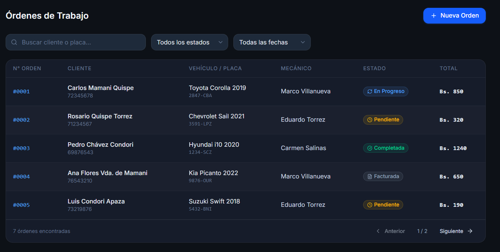
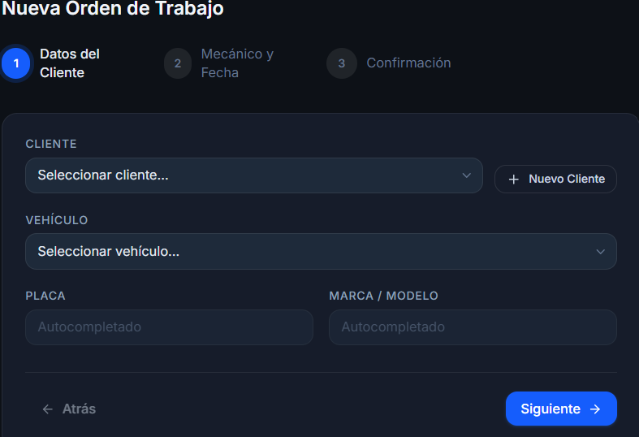
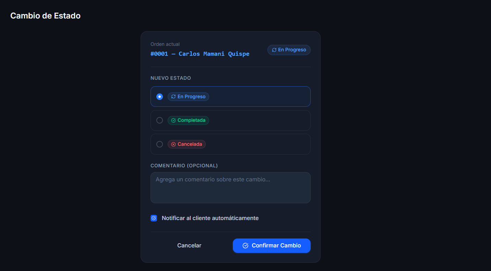

Talleres Automotrices

Aplicación web para la gestión de talleres automotrices. Incluye autenticación, roles, clientes, vehículos, citas, órdenes de trabajo, inventario, repuestos, pagos, facturas, reportes y portales para clientes, recepción y mecánicos.

## Requisitos

### Opción Docker

- Docker Desktop con el motor Linux iniciado.
- Docker Compose incluido en Docker Desktop.
- PostgreSQL accesible desde el contenedor, o el perfil MySQL incluido en el proyecto.

### Opción local, sin Docker

- PHP 8.3 o superior compatible con Laravel 12.
- Composer.
- Node.js y npm.
- PostgreSQL o MySQL instalado y ejecutándose.
- Extensiones PHP: `pdo_pgsql` o `pdo_mysql`, según el motor elegido; también `mbstring`, `openssl`, `bcmath`, `fileinfo`, `json`, `tokenizer`, `xml`, `ctype` y `zip`.

## Instalación inicial

Clona el repositorio y entra en la carpeta del proyecto:

```powershell
git clone <URL_DEL_REPOSITORIO>
cd Talleres-Automotrices
```

Instala las dependencias PHP y JavaScript:

```powershell
composer install
npm install
```

Crea el archivo de entorno:

```powershell
Copy-Item .env.example .env
php artisan key:generate
```

No compartas el archivo `.env`. Contiene las credenciales de la base de datos y debe permanecer fuera del repositorio.

## Ejecución con Docker y PostgreSQL externo

Esta es la configuración para usar PostgreSQL instalado en tu equipo Windows o en otro servidor. El archivo `compose.yaml` levanta solamente PHP-FPM y Nginx; no crea otro motor de base de datos.

### 1. Configurar `.env`

Si PostgreSQL está instalado en la misma máquina Windows que Docker Desktop:

```env
DB_CONNECTION=pgsql
DB_HOST=host.docker.internal
DB_PORT=5432
DB_DATABASE=test_taller
DB_USERNAME=postgres
DB_PASSWORD=TU_CONTRASEÑA
```

Si PostgreSQL está en otro servidor, cambia `DB_HOST` por su IP o DNS:

```env
DB_HOST=192.168.1.50
```

El servidor PostgreSQL debe aceptar conexiones desde Docker. Revisa `postgresql.conf`, `pg_hba.conf` y el firewall del servidor.

### 2. Iniciar Docker Desktop

Abre Docker Desktop y espera hasta que indique que está ejecutándose. Comprueba el motor:

```powershell
docker info
```

La salida debe mostrar una sección `Server`. Si aparece `dockerDesktopLinuxEngine` detenido o un error 500, reinicia Docker Desktop:

```powershell
wsl --shutdown
```

Luego vuelve a abrir Docker Desktop y espera a que termine de iniciar.

### 3. Construir y levantar la aplicación

```powershell
docker compose build
docker compose up -d
docker compose ps
```

La aplicación queda disponible en:

```text
http://localhost:8000
```

### 4. Ejecutar migraciones y datos iniciales

```powershell
docker compose exec app php artisan migrate --seed
```

Si el proyecto ya tiene migraciones ejecutadas, puedes usar:

```powershell
docker compose exec app php artisan migrate
```

## Ejecución con Docker y MySQL

El proyecto incluye `compose.mysql.yaml` como perfil opcional. Este archivo agrega un contenedor `mysql:8`, un volumen persistente y un `healthcheck`.

### 1. Configurar `.env` para MySQL

```env
DB_CONNECTION=mysql
DB_HOST=database
DB_PORT=3306
DB_DATABASE=tallerautomotrizdb
DB_USERNAME=taller_user
DB_PASSWORD=TU_CONTRASEÑA
```

`DB_HOST=database` es obligatorio dentro de Docker porque `database` es el nombre del servicio Compose.

### 2. Construir y levantar el perfil MySQL

Usa siempre los dos archivos Compose:

```powershell
docker compose -f compose.yaml -f compose.mysql.yaml build
docker compose -f compose.yaml -f compose.mysql.yaml up -d
docker compose -f compose.yaml -f compose.mysql.yaml ps
```

El contenedor MySQL debe aparecer como `healthy` antes de continuar.

### 3. Migrar y sembrar MySQL

```powershell
docker compose -f compose.yaml -f compose.mysql.yaml exec app php artisan migrate --seed
```

Para detener los servicios sin eliminar la base de datos:

```powershell
docker compose -f compose.yaml -f compose.mysql.yaml down
```

Para eliminar también el volumen de MySQL y comenzar desde cero, esta acción borra los datos locales:

```powershell
docker compose -f compose.yaml -f compose.mysql.yaml down -v
```

## Ejecución local sin Docker

En esta modalidad PHP, Composer, Node.js y la base de datos se ejecutan directamente en tu equipo.

### 1. Configurar la base de datos

Para PostgreSQL local:

```env
DB_CONNECTION=pgsql
DB_HOST=127.0.0.1
DB_PORT=5432
DB_DATABASE=test_taller
DB_USERNAME=postgres
DB_PASSWORD=TU_CONTRASEÑA
```

Para MySQL local:

```env
DB_CONNECTION=mysql
DB_HOST=127.0.0.1
DB_PORT=3306
DB_DATABASE=tallerautomotrizdb
DB_USERNAME=taller_user
DB_PASSWORD=TU_CONTRASEÑA
```

Crea la base de datos indicada antes de migrar. Por ejemplo, en PostgreSQL:

```sql
CREATE DATABASE test_taller;
```

En MySQL:

```sql
CREATE DATABASE tallerautomotrizdb CHARACTER SET utf8mb4 COLLATE utf8mb4_unicode_ci;
```

### 2. Preparar Laravel

```powershell
composer install
php artisan key:generate
php artisan migrate --seed
```

### 3. Preparar los assets

Para desarrollo con recarga automática:

```powershell
npm install
npm run dev
```

En otra terminal, inicia Laravel:

```powershell
php artisan serve
```

Abre `http://127.0.0.1:8000`.

Para generar assets de producción:

```powershell
npm run build
php artisan serve
```

También puedes usar el script de desarrollo de Composer, que inicia servidor, cola, logs y Vite:

```powershell
composer run dev
```

## Usuarios de prueba

Los seeders crean usuarios con contraseña inicial `123123`:

| Usuario | Rol |
| --- | --- |
| `admin` | Administrador |
| `sequeiro` | Recepcionista |
| `mecanico` | Mecánico |
| `cliente1` | Cliente |

Después de iniciar sesión, cambia las contraseñas en un entorno real.

## Pruebas y validaciones

Ejecutar la suite PHPUnit:

```powershell
php artisan test
```

Validar la sintaxis JavaScript:

```powershell
node --check public/js/dashboard.js
node --check public/js/client.js
node --check public/js/recepcion.js
node --check public/js/mecanico.js
```

Validar Composer:

```powershell
composer validate --no-check-publish
```

Validar Compose sin iniciar contenedores:

```powershell
docker compose config
docker compose -f compose.yaml -f compose.mysql.yaml config
```

Compilar las vistas Blade:

```powershell
php artisan view:cache
```

## Caché y mantenimiento

Limpiar cachés de Laravel cuando cambien rutas, configuración o vistas:

```powershell
php artisan optimize:clear
php artisan view:cache
```

Dentro de Docker:

```powershell
docker compose exec app php artisan optimize:clear
docker compose exec app php artisan view:cache
```

Si `optimize:clear` intenta conectarse a una base de datos que todavía no está disponible, usa primero comandos específicos:

```powershell
php artisan config:clear
php artisan route:clear
php artisan view:clear
```

Los archivos CSS y JavaScript locales usan `filemtime` como versión en la plantilla, por lo que los cambios de frontend invalidan automáticamente la caché del navegador. Si todavía ves una versión anterior, usa `Ctrl + F5`.

## Logs y estado de contenedores

Ver el estado:

```powershell
docker compose ps
```

Ver logs de Laravel y Nginx:

```powershell
docker compose logs -f app nginx
```

Con MySQL:

```powershell
docker compose -f compose.yaml -f compose.mysql.yaml logs -f app nginx database
```

Entrar al contenedor PHP:

```powershell
docker compose exec app sh
```

Comprobar extensiones PHP dentro del contenedor:

```powershell
docker compose exec app php -m
```

## Problemas frecuentes

### `failed to connect to dockerDesktopLinuxEngine`

Docker Desktop no está iniciado o su motor Linux todavía no está listo. Abre Docker Desktop, espera a que indique `Running` y ejecuta `docker info`.

### `request returned 500 ... dockerDesktopLinuxEngine`

El backend de Docker Desktop quedó atascado. Reinicia Docker Desktop. Si es necesario:

```powershell
wsl --shutdown
```

Vuelve a abrir Docker Desktop y repite `docker info`.

### `could not find driver`

El PHP que ejecuta el comando no tiene el driver de la base de datos. Dentro de Docker, reconstruye la imagen:

```powershell
docker compose build --no-cache
```

La imagen incluye `pdo_pgsql` y `pdo_mysql`. En instalación local, instala la extensión correspondiente en `php.ini`.

### PostgreSQL: `no hay una línea en pg_hba.conf`

PostgreSQL está recibiendo la conexión, pero no permite ese host, usuario o base de datos. Añade una regla adecuada en `pg_hba.conf`, configura `listen_addresses` en `postgresql.conf` y reinicia PostgreSQL.

### `Connection refused` a PostgreSQL

Comprueba que PostgreSQL esté iniciado, que el puerto sea `5432` y que `DB_HOST` sea correcto:

- Docker hacia PostgreSQL de Windows: `host.docker.internal`.
- Docker hacia otro servidor: IP o DNS del servidor.
- Laravel local hacia PostgreSQL local: `127.0.0.1`.

### La vista o los estilos parecen antiguos

Limpia la caché y recarga el navegador:

```powershell
php artisan view:clear
php artisan view:cache
```

Después usa `Ctrl + F5`.

## Imágenes y mockups








### Mockups


  

Imagenes de mockups
  
